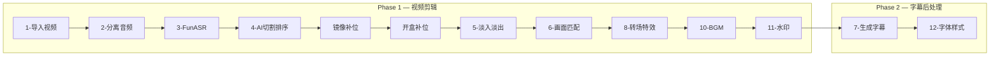

# Real Cut — 剪映带货切片全自动剪辑流水线

剪映5.9自动化剪辑流水线，专为直播带货切片设计。一个视频约2-5分钟出成品
（主要耗时在 FunASR 识别 + 千问 VL 画面分析）。**可直接批量处理多个视频。**

本 skill 为修复验证版：AI 断句（每段≤10字，AI 修错别字+定关键词）、关键字标黄用剪映原生机制、
字幕位置为屏幕上方 Y=-0.4167、content 双重嵌套自动修复。

---

## 一、环境依赖（首次使用必读）

### 路径速查

| 项目 | 路径 |
|------|------|
| 剪映主程序 | `C:\Users\JT\Desktop\剪映5.9Windows\JianyingPro\5.9.0.11632\JianyingPro.exe` |
| 草稿目录 | `C:\Users\JT\AppData\Local\JianyingPro\User Data\Projects\com.lveditor.draft` |
| 本 skill 脚本 | `scripts/`（相对 skill 目录） |
| 外挂关键词库 | `C:\Users\JT\Documents\剪辑\highlight_keywords.txt`（176个关键词，可编辑） |
| 金句爆点素材库 | `C:\Users\JT\Documents\剪辑\爆点+金句 素材库\爆点素材库\素材库`（26条金句音频） |

### 必要环境变量

- `DASHSCOPE_API_KEY` — 阿里云百炼 API Key（步骤4 AI分类 + 步骤6画面分析）

### 必要 Python 依赖

```
funasr modelscope dashscope openpyxl jieba
```

- `jieba` 用于步骤7断句（词边界切割，本 skill 核心修复）
- FunASR 模型首次下载约 2.2GB，缓存于 `D:\.cache\modelscope`，之后离线复用

---

## 二、两阶段架构



**核心原则**：Phase 2（字幕）完全独立于 Phase 1（剪辑），可在 Phase 1 完成后任意时刻重跑。
修改了关键词库或字幕格式后只需重跑 Phase 2，不影响剪辑结果。

---

## 三、关键配置参数（已确认，不可随意修改）

| 参数 | 值 | 所在脚本 | 说明 |
|------|-----|---------|------|
| 字号 | **10** | 步骤12 硬编码 | 所有字幕统一字号 |
| Y轴位置 | **-0.4166666666666667** | 步骤12 硬编码 | 归一化Y坐标，屏幕上方，对齐黄金草稿104 |
| 字体 | HelloFont ID JiangHuTi.ttf | 步骤12 硬编码 | 江湖体+白色填充+黑色描边0.08 |
| 描边宽度 | 0.08 | 步骤12 硬编码 | 黑色描边 |
| 关键词库路径 | `C:\Users\JT\Documents\剪辑\highlight_keywords.txt` | 步骤12 KEYWORD_FILE | 外挂可编辑，每行一个词 |
| 金句素材库 | `...\爆点素材库\素材库` | 步骤4 JINJU_FOLDER | 缺金句时自动补充 |
| 中文数字转阿拉伯 | 启用 | 步骤7 `chinese_num_to_arabic()` | "三千二百"→"3200" |
| 字幕断句 | **AI优先(≤10字) + jieba回退** | 步骤7 `ai_segment_text()` + `split_text_only()` | AI断句+修错别字+定关键词；无key回退jieba |
| 字幕长度上限 | **10字** | 步骤7 `MAX_CHARS=10` | 每段字幕≤10字更美观 |
| 字幕AI人设 | 多年电商直播话术编辑 | 步骤7 `ai_segment_text()` + `ai_review_transcript()` | 专业直播话术表达与平台合规审核 |
| 字幕违禁词 | 南沙港/中检仓/泰国及“绝对”“必买”“秒杀”等过于绝对的词 | 步骤7 `BANNED_WORDS` + AI提示词 | AI审核与关键词过滤双层拦截 |
| 关键字标黄 | `subtitle_keywords.range` + `config.subtitle_keywords_config` | 步骤12 | 剪映原生双写机制 |
| 关键字颜色 | `[1.0, 0.8705882430076599, 0.0]` 黄 | 步骤12 | 对齐草稿104黄金格式 |
| BGM | 时尚惬意驰放Positive Dreamy, -15dB | 步骤10 硬编码 | 默认BGM |
| 花字 | 关闭（默认跳过步骤9） | 步骤9 条件开关 | 当前业务不需要花字；需要时设 `REALCUT_ENABLE_HUAZI=1` |
| 水印 | 关闭 | 步骤11 | 已禁用 |
| 成片时长上限 | **30秒** | 步骤4 + 镜像补位 + 开盒补位 | 各阶段统一使用 `MAX_VIDEO_DURATION_MS=30000` 收敛 |
| 开盒画面 | 默认删除；时长<15s则补到开头+配金句音频 | 步骤4后 开盒补位.py | 关键业务规则 |
| 镜像补位音频 | 仅素材库音频，禁止原视频音频 | mirror_通用.py | `-an` ffmpeg标志 |
| 镜像补位去重 | 单次任务内不重复使用同一素材库音频 | mirror_通用.py `pick_audio(exclude=...)` | 避免补位音频听感重复 |

---

## 四、执行流程（按步骤单独跑，不要用 run_edit.py/run_subtitle.py）

> ⚠ **入口脚本的编码问题**：`run_edit.py` 和 `run_subtitle.py` 在 PowerShell 下存在 GBK 编码问题
> （中文输出报错）。**推荐按步骤逐个运行脚本**。下面的模板代码经过验证可正常工作。

### 标准单视频执行顺序（PowerShell）

```powershell
$v = "D:/工作空间/精剪/素材/你的视频.mp4"

# ── Phase 1 ──
python scripts/导入视频到剪映.py $v --no-open

# 获取草稿名（视频文件名去扩展名）
$name = [System.IO.Path]::GetFileNameWithoutExtension($v)
$dp = "C:\Users\JT\AppData\Local\JianyingPro\User Data\Projects\com.lveditor.draft\$name"

python scripts/步骤2-分离音频.py $dp --no-open
python scripts/步骤3-FunASR.py $dp --no-open
python scripts/步骤4-切割排序.py $dp --no-open
# 镜像补位 + 开盒补位（步骤4不会自动调用，需单独执行）
python scripts/mirror_通用.py $dp --no-open
python scripts/步骤4后-开盒补位.py $dp --no-open
python scripts/步骤5-淡入淡出.py $dp --no-open

# 步骤6（最慢，60-90s，调用千问VL API）
python scripts/步骤6-画面匹配.py $dp --no-open

# 步骤8-11（很快，每步<1s）
python scripts/步骤8-转场特效.py $dp
python scripts/步骤10-添加BGM.py $dp
python scripts/步骤11-添加水印.py $dp

# ── Phase 2（可在 Phase 1 完成后任意时间重跑）──
# ⚠ 步骤7和12前必须关闭剪映，否则后台覆盖草稿
taskkill //f //im JianyingPro.exe
python scripts/步骤7-生成字幕.py $dp
# 步骤7先把口播轨按最终时间轴合成完整语音轨，再整段FunASR+AI审核，字幕时间天然对齐
python scripts/步骤12-字体样式.py $dp
```

### 批量处理全流程（已验证通过，10个视频约30分钟）

```powershell
$videos = @("62","90","91","92","93","94","95","96","97","98")

# Phase 1: 步骤6（最耗时，逐个跑）
foreach ($v in $videos) {
  python "scripts\步骤6-画面匹配.py" "C:\Users\JT\AppData\Local\JianyingPro\User Data\Projects\com.lveditor.draft\$v" --no-open
}

# 步骤8-11（很快，可以批量跑）
foreach ($v in $videos) {
  python "scripts\步骤8-转场特效.py" "C:\Users\JT\AppData\Local\JianyingPro\User Data\Projects\com.lveditor.draft\$v"
  python "scripts\步骤10-添加BGM.py" "C:\Users\JT\AppData\Local\JianyingPro\User Data\Projects\com.lveditor.draft\$v"
  python "scripts\步骤11-添加水印.py" "C:\Users\JT\AppData\Local\JianyingPro\User Data\Projects\com.lveditor.draft\$v"
}

# Phase 2: 字幕（步骤7+12，先关剪映）
foreach ($v in $videos) {
  taskkill //f //im JianyingPro.exe
  python "scripts\步骤7-生成字幕.py" "C:\Users\JT\AppData\Local\JianyingPro\User Data\Projects\com.lveditor.draft\$v"
  python "scripts\步骤12-字体样式.py" "C:\Users\JT\AppData\Local\JianyingPro\User Data\Projects\com.lveditor.draft\$v"
}
```

---

## 五、外挂关键词库

### 位置

`C:\Users\JT\Documents\剪辑\highlight_keywords.txt`

### 格式

```
# 重点标记关键词库
# 一行一个关键词（中文直接匹配）
# ── 修改后保存即可，下次跑F1自动生效 ──

# === 价格数字 ===
一百
三百
九百
# === 面料材质 ===
亚麻
天丝
真丝
# === 带货互动 ===
家人们
老板娘
衣服
上车
包邮
```

### 维护说明

- 每次跑步骤12时自动读取该文件（`utf-8-sig` 读取去 BOM）
- 用户可随时编辑补充新关键词，支持中英文、数字组合
- 关键词越多，高亮越精准

### 当前词库规模（176个，2026-08-06）

覆盖：价格数字、面料材质、品质、爆点、金句、带货互动六大类。

---

## 六、分类规则（步骤4 AI分类）

### 排序顺序

```
爆点(第1段) → 展示衣服(第2段,尽量多) → 金句(第3段) → 价格(第4段)
```

### 数量限制

| 类别 | 上限 | 说明 |
|:----:|:----:|------|
| 爆点 | 1条 | 没有就从素材库补 |
| 展示衣服 | 不限 | 面料/细节/工艺/质量描述，宁多勿少 |
| 金句 | 1条 | 没有就从素材库补 |
| 价格 | 1条 | 具体价格数字，300元以上可删 |

### 成片时长

- 步骤4按 `爆点 → 展示衣服 → 金句 → 价格` 组织后，总时长最高 **30秒**。
- 超时时优先保留每个结构的第一段，再从多余的展示衣服段开始裁撤；仍超时则压缩/硬截到30秒内。
- 后续镜像补位和开盒补位也必须遵守同一个30秒上限，不允许补位后把成片拉长。
### AI分类提示词要点

- 「质量好/做工好/面料好」→ **展示衣服**（不是爆点）
- 「原版/复刻/供应链/做了X年」→ **爆点**
- 「XX块钱/XX元/开个XX」→ **价格**
- 面料词（桑蚕丝/天丝/莱赛尔/真丝/羊绒等）→ **展示衣服**
- 一句话同时提到面料和价格 → **优先归展示衣服**

---

## 七、铁律（必须遵守，否则成品会有严重问题）

### 🔴 铁律1：步骤4的 cat_order 必须包含全部分类

`cat_order = ['爆点','展示衣服','金句','价格']`
缺少「价格」会导致价格相关句子被丢弃，视频大幅缩水。

### 🔴 铁律2：Phase 2 可以无限次重跑

字幕步骤（7+12）独立于剪辑步骤，修改 keywords.txt 或字幕格式后只需重跑 Phase 2。

### 🟡 铁律3：画面匹配需清除缓存

步骤6会缓存 `_frame_full_cache_1s.json`。如果修改过步骤4的切割方案，**必须删除此缓存**
让步骤6重新分配画面。

### 🟢 铁律4：三文件同步

修改 `draft_content.json` 后，必须同步到 `draft_info.json` 和 `template-2.tmp`。
本脚本已统一通过 `_utils.write_draft()` 管理。

### 🟡 铁律5：展示衣服段数不足时必须镜像补位

`mirror_通用.py` 会自动执行。补位画面只能用素材库音频（`-an` 标志），绝不能使用原视频音频；同一任务内素材库音频也必须去重，且补位后总时长不超过30秒。

### 🟢 铁律6：开盒画面处理规则

开盒画面默认从剪辑结果中删除。但如果最终视频时长 **< 15秒**，则将开盒画面补到视频开头，
并配上金句素材库的音频。
补位后的新总时长同样不能超过30秒；若空间不足，优先保留开盒画面，金句音频可裁剪或跳过。

### 🔴 铁律7：字幕断句 AI 优先，jieba 兜底

步骤7先调 `ai_segment_text()`（千问断句+修错别字+定关键词，每段≤10字），
无 `DASHSCOPE_API_KEY` 或 AI 失败时回退 `split_text_only()`（jieba 词边界）。
**禁止**退回旧版硬编码 protect_words 词表（会拆碎"衣服"→"衣/服"、"3000/4000块"→"3000/"）。

### 🔴 铁律8：关键字标黄必须双写，content 统一 rich JSON

- **素材级** `materials.texts[].subtitle_keywords = {"range":[{"length":N,"location":start},...]}`
- **顶层** `config.subtitle_keywords_config`（黄色样式，见下方详细说明）
- 所有字幕 content 必须统一为 rich JSON `{"styles":[...],"text":"..."}`
- **纯文本与 JSON 混合时，纯文本字幕会被 config 的 placeholder 样式整条染黄**

### 🟢 铁律9：写盘前必须关闭剪映

步骤12已内置检测（`_check_jianying_closed()`），检测到剪映运行即终止。
手动批量跑时也要先 `taskkill //f //im JianyingPro.exe`（Git Bash 用 `//f` 不是 `/f`）。

### 🔴 铁律10：字幕审核必须使用电商直播话术编辑人设并过滤违禁词和过于绝对的词

步骤7的 AI 断句和整段审核提示词固定为“拥有多年电商直播话术编辑经验的字幕编辑”。必须禁止输出“南沙港”“中检仓”“泰国”等违禁词，以及“绝对”“秒杀”“必买”“必入”等过于绝对的词；AI关键词过滤层也要同步拦截这些词。

### 🔴 铁律11：成片总时长不得超过30秒

步骤4、镜像补位、开盒补位三个阶段都必须受 `MAX_VIDEO_DURATION_MS=30000` 约束。任何自动补素材、补金句、补开盒画面后，最终时间轴都不能超过30秒。

### 🔴 铁律12：镜像补位只能补画面，且不得重复使用音频

镜像补位必须保留 `-an` 生成纯画面视频，不复制原视频口播。补位音频只能来自素材库，且单次任务内 `pick_audio()` 通过 `exclude` 去重，避免同一段音频被多次使用。

---

## 八、关键字标黄完整机制（重要，2026-08-06 确认）

剪映「智能划重点」底层 = **两条数据配合，缺一不可**：

1. **素材级 `materials.texts[].subtitle_keywords = {"range": [...]}`**
   — 定义哪些字符是关键字。格式：`[{"length": 2, "location": 4}, ...]`（length+location，非起止区间）

2. **顶层 `config.subtitle_keywords_config`** — 定义关键字预设样式：
   ```json
   {
     "font_size_ratio": 1.0,
     "styles": "{\"styles\":[{\"fill\":{\"alpha\":1.0,\"content\":{\"render_type\":\"solid\",\"solid\":{\"alpha\":1.0,\"color\":[1.0,0.8705882430076599,0.0]}}},\"range\":[0,11],\"size\":10.0,\"strokes\":[{\"alpha\":1.0,\"content\":{\"render_type\":\"solid\",\"solid\":{\"alpha\":1.0,\"color\":[0.0,0.0,0.0]}},\"width\":0.06}],\"useLetterColor\":true}],\"text\":\"placeholder\"}",
     "subtitle_template_keywords_original_font_size": 0.0,
     "subtitle_template_original_font_size": 0.0
   }
   ```

**踩过的坑（必须避免）：**
- 只写 `subtitle_keywords.range` 不写 `config.subtitle_keywords_config` → 关键字不显色
- config 的 styles color 是白色 `[1,1,1]` → 关键字显示白色（用户全选点黄后剪映自动生成的白样式）。
  要黄色必须 `[1.0, 0.8705882430076599, 0.0]`
- content 纯文本与 JSON 混合 → 纯文本字幕整条被染黄
- content 是 JSON 字符串但 `is_rich_text=False`，剪映会解析渲染，不会显示 JSON 代码

**content 的样式结构（每段字幕）：**
- 普通段：白 fill `[1,1,1]` + 黑描边 width 0.08 + size 10
- 关键字段：黄 fill `[1.0,0.8705882430076599,0.0]` + 黑描边 width 0.06 + size 10
- 完整示例：
  ```json
  {"text": "老板娘的衣服就是上档次", "styles": [
    {"fill": {"content": {"solid": {"color": [1.0,0.8705882430076599,0.0]}}}, "range": [0,3], "size": 10, "strokes": [{"width": 0.06}]},
    {"fill": {"content": {"solid": {"color": [1.0,1.0,1.0]}}}, "range": [3,4], "size": 10, "strokes": [{"width": 0.08}]},
    ...
  ]}
  ```

**步骤12 `get_yellow_ranges(text, keywords)` 的标黄规则：**
- 阿拉伯数字连续序列（`\d+`）→ 黄
- 中文数字（含"十百千万"单位，如"三千""六百九"）→ 黄
- 关键词库匹配（按长度降序，避免短词先命中覆盖长词边界）→ 黄

---

## 九、字幕断句机制（AI 优先 + jieba 回退，2026-08-06 修复）

步骤7断句采用**两级架构**：有 DASHSCOPE_API_KEY 时用千问 AI 断句，无 key 或 AI 失败时回退 jieba。

### AI 断句（优先）

`ai_segment_text(text)` 调用千问 `qwen-plus`，让 AI：
1. **断句**：每句 ≤10字，语义完整、断在意思完整处
2. **修错别字**：ASR 误识（如"伤残"→"桑蚕丝"、"双抽"→"上车"），口语数字转阿拉伯
3. **定关键词**：挑 1-4 个卖点词（价格/面料/互动词），供步骤12标黄

AI 提示词固定为“拥有多年电商直播话术编辑经验的字幕编辑”，并要求遵守平台合规：
- 不输出“南沙港”“中检仓”“泰国”等违禁词
- 不输出“最”“第一”“绝对”“必买”“秒杀”等过于绝对的词
- 关键词也不能选中违禁词或过于绝对的词
**关键约束（已实现）：**
- 文本保真度校验：AI 输出必须保留原文 ≥85%，否则回退本地（防 AI 改写）
- 超长段（>10字）用 jieba 补切
- AI 关键词回写关键词库前过滤噪声（单字虚词、无意义词）
- `temperature=0.1` 保证稳定

### jieba 回退

`split_text_only()` 用 jieba 词边界断句，**每段 ≤10字**：
1. 按 `。？！.!?` 分成句子
2. 每句 ≤10字 直接保留
3. 超长句按 `，、；,;` 拆成子句
4. 子句仍超长 → `_split_long_sub()` 用 jieba 词边界找最优断点：
   - 断点落在词起点（词尾可断）
   - **数字保护**：断点不能在数字/`/` 内（保护 `3000/4000块`）
   - **虚词吸回**：`的了着过在和与是` 开头的段吸回前段
   - **量词吸回**：`块元个件` 开头的段吸回前段（避免"块的衣服"开头）
   - **孤立字保护**：尾段 ≤2字 并入前段（避免"赶紧来"+"抢"）
5. 中文数字转阿拉伯（`chinese_num_to_arabic`）后再断句

**依赖**：`pip install jieba`（回退用）+ `dashscope`（AI断句用）+ `DASHSCOPE_API_KEY` 环境变量。

---

## 九点五、双重 JSON 嵌套修复（2026-08-06）

**现象**：草稿 content 出现 `{"text": "{\"text\":\"...\",\"styles\":[...]}", "styles":[...]}` —— content 的 text 字段又被包了一层 JSON 字符串。剪映会把内层 JSON 当文本渲染，字幕显示乱码。

**原因**：AI 改写草稿时把 `build_rich_content` 的输出（已是 JSON 字符串）又塞进新 dict 的 text 字段。

**修复**：步骤12的 `get_text()` 增加 `_extract_plain_text()` 递归解包：
- 若 text 字段的值本身是 JSON 字符串（双重嵌套），继续解析直到拿到纯文本
- 配合 `json.loads` 处理任意层级嵌套

**防御**：步骤12重跑时，双重嵌套会被自动识别并重建为正确的单层 rich JSON。

---

## 九点六、步骤7 v4：最终完整语音轨 ASR（2026-08-08）

**核心变化**：步骤7不再按片段/文件名推算字幕时间，而是先把口播轨所有 clip 按剪映最终时间轴合成为 `_full_voice.wav`，再对整段音频跑 FunASR，得到的时间戳就是最终时间线。

1. `get_speech_audio_segments()` 自动识别口播轨（优先含 `clip_*.mp3` 最多的 audio 轨道），排除 BGM/音效轨。
2. `build_full_voice_audio()` 用 ffmpeg 按 `target_timerange` 排入完整时间轴，`src_timerange` 精确取片。
3. FunASR 识别整段语音，结果缓存到 `_full_voice_asr.json`（指纹变化自动重跑）。
4. `ai_review_transcript()` 用千问对整段 ASR 审核错别字、数字和明显不通顺处，句子数量和顺序保持不变。
5. 断句后直接使用整段 ASR 时间戳；无逐字数据时按已断好的短句比例分时，不会再把金句重新切碎。
6. 内置金句36已知断句修正（`fix_known_golden_quote` / `split_with_known_golden_quote`），后续新金句可在此追加。

---

## 十、常见问题排查

| 现象 | 原因 | 解决 |
|------|------|------|
| 视频太短(<5s) | cat_order 缺少价格 | 检查分类列表完整性 |
| 步骤4分类异常 | AI分类不准 | 查看详情，必要时手动修正 |
| 步骤6卡住/超时(>180s) | VL API调用耗时 | 正常等待；有缓存则秒过 |
| 字幕显示JSON代码 | content 双重嵌套 | 重跑步骤12自动修复（get_text 递归解包） |
| 关键字不标黄 | 只写了 range 没写 config | 检查 config.subtitle_keywords_config 是否存在且 color 为黄 |
| 关键字白色 | config styles color 是白 | 改成 `[1.0,0.8705882430076599,0.0]` |
| 纯文本字幕整条黄 | content 格式混合 | 统一所有字幕为 rich JSON |
| 字幕位置在下边 | Y 值错了 | 应为 -0.4166666666666667（屏幕上方） |
| 字幕拆碎(衣/服) | 断句回退硬编码 | 确认步骤7用 AI/jieba 版本 |
| 字幕超10字 | MAX_CHARS 被改 | 步骤7 split_text_only 的 MAX_CHARS=10 |
| 金句音频和字幕没对齐 | 按片段/文件名推算时间 | 步骤7 v4：合成最终完整语音轨后整段ASR，时间来自最终时间轴 |
| 关键词未标黄 | keywords.txt 缺失 | 检查路径，重跑步骤12 |
| 步骤9崩 PermissionError | 剪映正在运行占用文件 | `taskkill //f //im JianyingPro.exe` |
| PowerShell中文乱码 | GBK编码问题 | 单个脚本直接调用，不用 run_edit.py |

---

## 十一、脚本说明

所有流水线脚本在 `scripts/` 目录下。**本 skill 已内置全部脚本，自包含可运行。**

### 各步骤脚本

| 步骤 | 脚本 | 功能 |
|:----:|------|------|
| 1 | `导入视频到剪映.py <视频路径>` | 创建剪映草稿 |
| 2 | `步骤2-分离音频.py <草稿路径>` | ffmpeg分离音视频 |
| 3 | `步骤3-FunASR.py <草稿路径>` | 本地离线ASR识别（逐字时间戳） |
| 4 | `步骤4-切割排序.py <草稿路径>` | 千问AI分类排序，最终总时长收敛到30秒内 |
| — | `mirror_通用.py <草稿路径>` | 展示衣服<3段时镜像补位；纯画面+素材库音频去重，总长不超过30s |
| — | `步骤4后-开盒补位.py <草稿路径>` | 开盒检测+短片<15s补位；补位后不超过30s |
| 5 | `步骤5-淡入淡出.py <草稿路径>` | 每段音频200ms淡入淡出 |
| 6 | `步骤6-画面匹配.py <草稿路径>` | 千问VL逐帧分析（1s采样）+分配画面 |
| 8 | `步骤8-转场特效.py <草稿路径>` | 跳变最大2处加转场 |
| 9 | `步骤9-花字音效.py <草稿路径>` | 默认关闭；设 `REALCUT_ENABLE_HUAZI=1` 后才添加前/中/后3组花字+音效 |
| 10 | `步骤10-添加BGM.py <草稿路径>` | -15dB默认Positive Dreamy |
| 11 | `步骤11-添加水印.py <草稿路径>` | 已关闭（跳过） |
| 7 | `步骤7-生成字幕.py <草稿路径>` | 合成最终完整语音轨→整段FunASR→AI整段审核（电商直播话术编辑人设+违禁词过滤）→按最终时间轴断句导入字幕 |
| 12 | `步骤12-字体样式.py <草稿路径>` | 江湖体+白字黑描边+字号10+Y-0.4167+关键字标黄 |

### 核心工具

- `_utils.py` — `write_draft(dp, draft)` 三文件同步 + `uid()`
- `_video_assign.py` — 步骤6画面分配辅助
- `导入字幕.py` — 步骤7调用，将字幕.txt 导入草稿为 subtitle 素材（utf-8-sig 去 BOM）

### 草稿路径格式

```
C:\Users\JT\AppData\Local\JianyingPro\User Data\Projects\com.lveditor.draft\<序号>
```

序号 = 视频文件名（不含扩展名）。如 `36.mp4` → `...\draft\36`。

---

## 十二、步骤完成验证

每个步骤完成后，打开草稿展示给用户看：

```powershell
taskkill //f //im JianyingPro.exe
Start-Process "C:\Users\JT\Desktop\剪映5.9Windows\JianyingPro\5.9.0.11632\JianyingPro.exe"
# 等待 ~20 秒加载
# 手动打开草稿查看效果
```

---

## 更新记录

- **2026-08-06（本版）**：修复版。jieba 断句（不再拆碎词）、关键字标黄双写机制
  （subtitle_keywords.range + config.subtitle_keywords_config）、字幕位置 Y=-0.4167、
  关键词库扩至176个、字幕 BOM 修复、写盘前检测剪映进程。
- **2026-08-15**：花字默认关闭。步骤9增加 `REALCUT_ENABLE_HUAZI` 开关，未设置时自动跳过花字与音效，业务条件为不需要花字。
- **2026-08-15（字幕与成片合规）**：步骤7 AI 字幕审核增加多年电商直播话术编辑人设，并拦截“南沙港/中检仓/泰国”及过于绝对的词；步骤4、镜像补位、开盒补位统一限制成片不超过30秒；镜像补位保持纯画面，并禁止同一任务内重复使用素材库音频。
